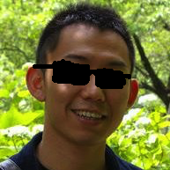

Strip off sunglasses! : Discrete Hopfield Network
==============================

## Summary ##
This Python code is just a simple implementaion of discrete Hopfield Network (http://en.wikipedia.org/wiki/Hopfield_network). 
Discrete Hopfield Network can learn patterns and remember (recover) the patterns when the network feeds those with noises.

## Example (What the code do) ##
For example, you input a neat picture like this and make the network to memorize the pattern (My code automatically transform RGB Jpeg into black-white picture). 


After that, if you put the picture like this into the network.



The network can strip off the sunglasses because the network remembers the former picture.


# Instructions #
##Input files##
JPEG files like those in "train_pics".
Network learns those pics as correct pics.
If you want to add new pics, please put them in "train_pics" folder.

##Test files##
The pictures with sunglasses should be in "test_pics" folder. 

##How to run the code##
Prior to running my code, please install the following libraries.
- numpy
- random
- Image
- os
- re

Also, Here is the way to run my code.
- Theta is the threshold of the neuron activation.
- Time is a parameter telling the steps of remembering the learned pictures. As the number of the steps increases, the remembered picture is more accurate.
- size is the picture size in pixel. If you put a pic with different sizes, the code resize it.
- threshold is the cutoff threshold to binarize 1 byte (0 to 255) brightness.
- current_path should be current working folder path (usual way is os.getcwd())

After you download all the files in this repository, please run "hopfield.py". Here is the main code.
```
#First, you can create a list of input file path
current_path = os.getcwd()
train_paths = []
path = current_path+"/train_pics/"
for i in os.listdir(path):
    if re.match(r'[0-9a-zA-Z-]*.jp[e]*g',i):
        train_paths.append(path+i)

#Second, you can create a list of sungallses file path
test_paths = []
path = current_path+"/test_pics/"
for i in os.listdir(path):
    if re.match(r'[0-9a-zA-Z-_]*.jp[e]*g',i):
        test_paths.append(path+i)

#Hopfield network starts!
hopfield(train_files=train_paths, test_files=test_paths, theta=0.5,time=20000,size=(100,100),threshold=60, current_path = current_path)
```


## Reference ##
- http://en.wikipedia.org/wiki/Hopfield_network
- http://rishida.hatenablog.com/entry/2014/03/03/174331 (in Japanese)

***
